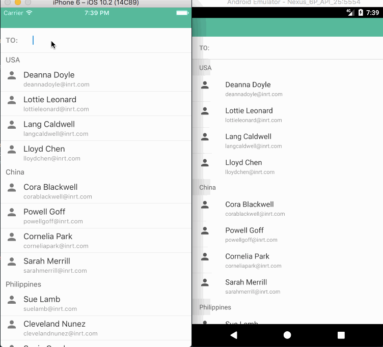

# react-native-cell-components
awesome react-native cell components! As the package name says, components that revolves around a `Cell` component. From `ActionSheet` to modal `TagsInput` + `SelectList` -- supports redux as well! **RN 0.40**
> This is currently on heavy development so expect rapid changes.

## Features/To-do
- [x] Components are re-used
- [x] Supports redux
- [x] [Realm](https://github.com/realm/realm-js) support for ListView
- [ ] Android support (PRs welcome)
- [ ] Custom user theme

## Components
- Cell
- ActionSheet
- CellGroup
- CellInput
- CellListProvider / CellListProviderRealm
- DatePicker (ios atm)
- SelectList / SelectListRealm
- TagsInput

## Dependencies
[react-native-blur ^2.0.0](https://github.com/react-native-community/react-native-blur)
[react-native-vector-icons ^4.0.0](https://github.com/oblador/react-native-vector-icons)

## Usage & Props
_coming soon_

## Credits
Feedback and PRs are welcome!

## License
See [LICENSE](LICENSE) file.

[@lodev09](http://twitter.com/lodev09) / [www.lodev09.com](http://www.lodev09.com "www.lodev09.com")
